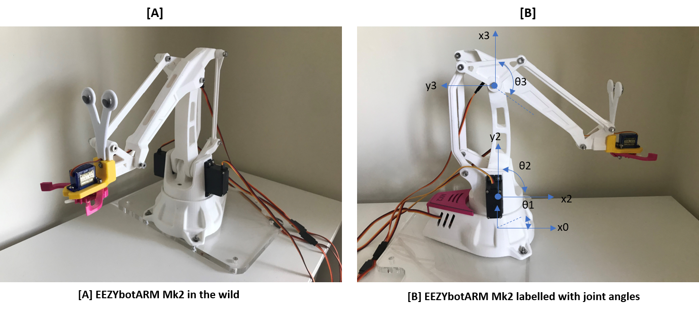
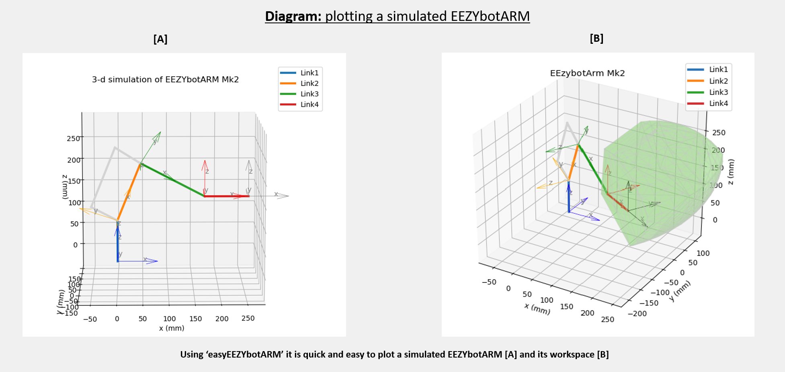
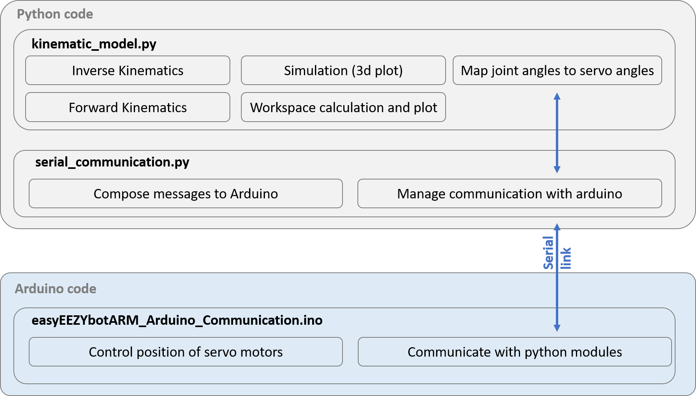

# easyEEZYbotARM
A python and arduino controller for the EEZYbotARM Mk1 & Mk2 (Includes 3-D kinematics) 



## Contents

- Introduction
- Overview
- Installation
- Configuration(of the physical arduino setup)
- Guidance on use
- Help and updates

## Introduction

This code library provides functionality to control the EEZYbotARM (Mk1, Mk2) in 3-D space. Specifically its functionality includes: 

1. 3-D Forward kinematics
2. 3-D Inverse kinematics
3. Plotting of the (simulated) robot arm
4. Plotting of the (simulated) workspace of the robot arm
5. Communicating with a (arduino) microcontroller
6. Using the (arduino) microcontroller to control the movement of the robot arm servo motors

## Overview

### Forward Kinematics
The code library allows the user to easily map joint angles to an x,y,z co-ordinates, so that we know the position of the end effector


### Inverse Kinematics
The code library allows the user to easily map x,y,z co-ordinates to joint angles, so that the EEZYbotARM can be controlled in 3-D space


### Simulation the robot arm, and plotting the robot arm workspace
The code library allows the user to easily plot a (simulated) robot arm. It is easy to calculate and plot the robot arm workspace. As well as checking whether a cartesian (x,y,z) point is within or outside the workspace.


## Installation 
This code library is distributed with python and arduino components. The python code is responsible for high level kinematics calculations and simulation. The arduino code is responsbile for low level servo control.

### Installation (python)

This python code is distributed as a python package. A setup file is included and so dependent libraries should install with the package.

To install the package on Windows, OS X or Linux:

(1) Download the easyEZZYbotARM zip file or clone the github repository
(2) Then open a terminal window and navigate to the setup.py directory using the 'cd' command
(3) Install the package using the pip command:

```sh
pip install .
```

To use with a virtual environment

(1) Download the easyEZZYbotARM zip file or clone the github repository
(2) Create a virtual environment (e.g. using conda or venv), then activate it in a terminal window
(3) Then inside this terminal window, navigate to the setup.py directory using the 'cd' command 
(4) Install the package using the pip command:

```sh
pip install -e . 
```

A future aim is to distribute this module using pip

### Installation (arduino)

To install the arduino code it is as simple as uploading the sketch 'arduino_sketches\easyEEZYbotARM_Arduino_Communication' to the arduino microcontroller.

The easiest way to do this is using the arduino IDE, see instructions at: https://www.arduino.cc/en/Main/Software 

## Configuration (of the physical arduino setup)
This is the reference setup using the 'easyEZZYbotARM' repository. The servo motors represent the servo motors mounted on the EEZYbotARM.


This diagram is created using Fritzing. The Fritzing files can be found at '/fritzing_files'

Instructions for building a EEZYbotARM can be found here: http://www.eezyrobots.it/eba_mk2.html

## Guidance on use

### Examples
- For examples of basic usage see the '/examples' folder

### Software Architecture



## Bug list

- Currently no bugs are listed here

## Help and updates

If you need help using this code libray, please in the first instance try googling your problem to see if you can find a solution. If that doesn't help then please do feel free to initiate a pull request on github.

## Contributing

Anyone is very welcome to contribute - please do. Below is a list of identified improvements.

Some useful best practice guidelines are here: https://opensource.guide/how-to-contribute/

### To do

- Kinematic Equations: These will be documented in a seperate web post
- Add example for plotting workspace
- Add instructions for installing servo motors and calibrating
- Make plot (simulation) of virtual robot arm non blocking


## Thanks and credit

-	Thanks to you for reading this and considering using this code library 
-	A big thanks to Carlo Franciscone for open sourcing the EEZYbotARM (http://www.eezyrobots.it/eba_mk2.html)
-   A big thanks to ArminJo for creating the fantastic arduino ServoEasing library: https://github.com/ArminJo/ServoEasing
-	Big thanks to Dr Antonia Tzemanaki at the University of Bristol / University of the West of England course, what an amazing teacher.
-	Thanks to Professor Angela Sodemann and Professor Peter Corke for putting their wonderful courses on inverse and forward kinematics online. You can find these courses here (https://www.youtube.com/playlist?list=PLT_0lwItn0sAfi3o4xwx-fNfcnbfMrXa7) and here (https://robotacademy.net.au/)
